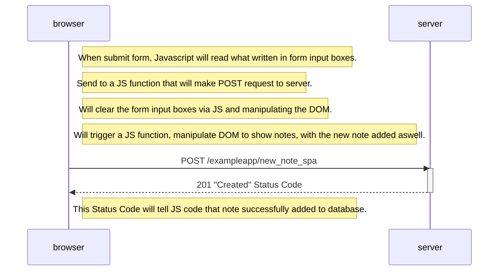

```mermaid
sequenceDiagram
    participant browser
    participant server

    Note right of browser: When submit form, Javascript will read what written in form input boxes.
    Note right of browser: Send to a JS function that will make POST request to server. 
    Note right of browser: Will clear the form input boxes via JS and manipulating the DOM.
    Note right of browser: Will trigger a JS function, manipulate DOM to show notes, with the new note added aswell.

    browser->>server: POST /exampleapp/new_note_spa
    activate server
    server-->>browser: 201 "Created" Status Code
    deactivate server

     Note right of browser: This Status Code will tell JS code that note successfully added to database.
    
```